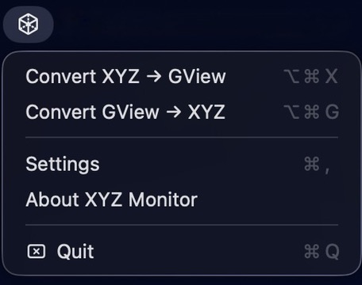

# XYZMonitor for Mac

这是 [xyzTrickGview2](https://github.com/bane-dysta/xyzTrickGview2) 的一个原生的 macOS 版本，基于 SwiftUI 实现，使用 Swift 重写，用于将 XYZ 结构快速打开到Gaussview中，并支持反向转换。



## 功能

- **剪贴板工作流**：复制 XYZ 坐标后按快捷键，自动调用外部查看器打开结构
- **反向转换**：把查看器里的结构导回为 XYZ 文本
- **菜单栏运行**：以菜单栏应用的形式运行，轻量且不占桌面
- **全局热键**：可自定义快捷键，快速触发转换
- **临时文件自动清理**：打开后自动删除中间文件
- **设置界面**：可配置查看器路径、热键和日志

## 运行要求

- macOS 12.0 或更高版本
- Xcode 15 或更高版本（用于从源码构建）

## 快速开始

### Github release

直接从 [release](https://github.com/cfx2020/xyzTrickGview2-for-Mac/releases) 界面下载 dmg 文件

### 命令行构建

```bash
chmod +x build.sh
./build.sh release
```

构建完成后会生成可执行文件到 `dist/XYZMonitor`。

同时会生成发布用应用包到 `dist/XYZ Monitor.app`。

### 使用 Xcode 构建

```bash
open Package.swift
# 然后在 Xcode 里按 ⌘B 构建
```

### 生成 DMG

```bash
chmod +x create-dmg.sh
./create-dmg.sh "dist/XYZ Monitor.app" XYZMonitor.dmg
```

## 使用方法

1. 启动应用后，菜单栏会出现图标。
2. 在“Settings”里配置Gaussview路径。
3. 复制一段 XYZ 文本。
4. 按默认快捷键 `⌘⌥X`，应用会调用Gaussview打开结构。
5. 需要反向转换时，在 Gaussview 中复制结构，按默认快捷键 `⌘⌥G`，转换为 xyz 到剪贴板。

## 配置项

设置会保存到 macOS 的 UserDefaults 中：

- `hotkey_xyz_to_gview`：XYZ → 查看器，默认 `cmd+alt+x`
- `hotkey_gview_to_xyz`：查看器 → XYZ，默认 `cmd+alt+g`
- `viewer_command`：查看器路径
- `temp_directory`：临时文件目录
- `cleanup_delay_seconds`：临时文件清理延迟
- `log_level`：日志级别
- `log_file_path`：日志文件路径

## 目录说明

- `XYZMonitor/Sources/AppDelegate.swift`：菜单栏、热键和打开文件逻辑
- `XYZMonitor/Sources/ConverterService.swift`：XYZ 与 GJF / 文本转换
- `XYZMonitor/Sources/ClipboardService.swift`：剪贴板读写
- `XYZMonitor/Sources/HotkeyService.swift`：全局热键注册
- `XYZMonitor/Sources/ConfigStore.swift`：设置持久化
- `XYZMonitor/Sources/ConfigurationView.swift`：设置界面
- `XYZMonitor/Sources/Logger.swift`：日志输出


## 开发

### 调试构建

```bash
swift build -c debug
.build/debug/XYZMonitor
```

### 查看日志

```bash
tail -f ~/Library/Application\ Support/XYZMonitor/xyz_monitor.log
```

